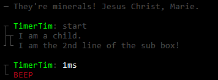

<h1 align="center">
	
</h1>

#### Massively extends the `console` features to produce human readable output. Provides content boxes using ASCII box-drawing characters, improvements for the output of object inspections (using tables), stack traces and more. It can even beep! ####

#### → [Screenshot of `console.help`](https://raw.githubusercontent.com/safebyte/console2/master/media/help.png)

## Features

- Structured output using [ASCII box-draing characters](https://en.wikipedia.org/wiki/Box-drawing_character)
- Fully compatible to the system `console`
- Improved object inspection (pretty nice tables)
- Improved stack traces
- Improved timer
- Ability to nest boxes
- Additional console features
- Various formatting shortcuts
- Clean and focused
- Intelligent use of colors to make contents even more distinguishable
- Actively maintained

## Install

```
$ npm install --save console2
```

### Quick Start

Have a [screenshot](https://raw.githubusercontent.com/safebyte/console2/master/media/help.png) of the output because you're lazy.

```javascript
require('console2')();
console.help();
```

## Usage

Console2 integrates seamlessly into the node `console`. However, you should make yourself familiar with the additional features, especially `box`, `line`, `over` & `out`.

```javascript
require('console2')();

// log a string
console.log("They're minerals! Jesus Christ, Marie.");
// as you know and love it, native methods are fully supported

// logs a string "the new way"
console.line("You shall not pass (immediately)");
// this queues your string until you call "console.out"
// read more on this below

// insert empty line & start a timer
console.spacer().time('TimerTim');

// build a box - returns a new console instance
var box = console.box('I am a child.');

// add a line to our new box
box.line('I am the 2nd line of the sub box!');

// indicate that the box can be printed and there will be no more lines/boxes appended to it
box.over();

// insert empty line & print timer
console.spacer().time('TimerTim');

// make noise
console.beep();

// print everything, this exists because most actions are async
console.out();
```

#### Result



# Managing boxes. **Over** and **Out**.

The main feature is the generation of *easy-to-read ASCII box-drawing character sections* - short: **boxes**.

```
// returns a new console instance which acts as a child box
var box = console.box();
```

These boxes are 2 dimensional (meaning they depend on the previous / following lines), you can no longer *just stdout a line* when building a box. Doing so would result in a big mess of lines without any context to each other, because of the [nature of time](https://en.wikipedia.org/wiki/Asynchronous_operation). Imagine you want to log the process of updating a database inside a single box, whilst complimenting yourself:

```js
box.log('Trying database update');
setTimeout(function mimicDatabaseUpdate(){
   box.log('Database updated');
}, 1);
console.log('You look gorgeous!');

// expected output:
// ├ You look gorgeous
// ├─ Starting database update
// └─ Database updated

// actual output:
// ├─ Starting database update
// ├ You look gorgeous
// └─ Database updated
```

#### *"Houston we have a problem."*

As you see, you need to wait until you are done adding new lines before you can print a box. The solution is simple: **We queue stuff**.
Instead of `console.log`, use `console.line`. It does the same thing, except for calling `stdout` (it's not printing the line).

```js
box.line('Trying database update');
setTimeout(function mimicDatabaseUpdate(){
   box.line('Database updated');
}, 1);
console.log('You look gorgeous!');
```

*But now there's only the part where I compliment myself?* Right, here's what happened: You've added a line, then printed everything *that's ready* (`console.log` did that) and finally added another line to your box. But you didn't mark the box as **over** / *ready* and therefore console2 thinks you might want to add more lines.

#### "No you don't. Over and out!"

```js
   // ...
   box.line('Database updated').out();
   // ..
```

By calling `console.out()` (or in this case `box.out()`) **you tell** the parent of all boxes **to print** every child box *that's ready*.

**Pro-Tip:** *`out` can take the same arguments as `line` does. So you could simplify the above to: `box.out('Database updated')`.*

#### *"And what about over? Over."*

You might run into situations where you want to mark a box as printable but don't want to print everything. For example when you're working on multiple child-boxes at once: you have to wait until every child box is done, before you can output the whole thing. That's what `box.over` is for:

```js
var box = console.box('I am a box with children');
var child1 = box.box('I am child #1');
var child2 = box.box('I am child #2');

async.each(arr, function iterate(data, callback){
	child1.line('Processing item #1:', data);
}, function onEnd(){
	child1.over();
});

// you don't know if i'm faster or slower than the onEnd above!
setTimeout(function(){
	child2.line('Hello friend').over();
}, 123);

// i am some handy event in the future (or even an interval if you're a crazy person):
function(){
	console.out();
}
```

**Pro-Tip:** *`over` can take the same arguments as `line` does. So you could simplify the above to: `box.over('Hello friend')`.*

# Reference

Console2 not only improves the native console functions (`log`, `info`, `warn`, `error`, `dir`, `time`, `timeEnd`, `trace`) but also provides additional functions.

***

#### ``console.help()``
Displays a [short tutorial with examples](/media/help.png).

***

#### ``console.box(content, option)``
Create a sub box.

***

#### ``console.line({...*}[, option])``
Add a line.

***

#### ``console.over({...*}[, option])``
Adds a line and sets the option `{over:true}`

***

#### ``console.out({...*}[, option])``
Flush current buffer (use this to actually **see** something).

***

#### ``console.spacer()``
Flush current buffer + adds an empty line.

***

#### ``console.log({...*}[, option])``
Same as `console.line` but with an additional call to `console.out` to remain compatible to the native `console`.

***

#### ``console.title({String} line)``
Creates a title by adding two lines (above & below) the text.

***

#### ``console.beep({String} [label])``
Makes your terminal beep, outputs `beep: label`.

***

#### ``console.time({String} [label], {Boolean} [reset])``
Very useful stopwatch that shows the elapsed time in a readable format (ms + years, months, days...).
**When called twice, the time in between the two calls is also measured & displayed!**

```javascript
// Prints time since box was initialized
console.time();

// (1st call) starts a new timer, outputs 'TimerTony: start'
console.time('TimerTony');

// (1st call) same as above, no output
console.time('TimerTony', true);

// (2nd call) outputs 'TimerTony: Xms'
console.time('TimerTony');

// (2nd call) outputs 'TimerTony: Xms - reset', resets the timer
console.time('TimerTony', true);
```

***

#### ``console.trace({String} [label])``
Beautified `console.trace`.

***

#### ``console.options({Object|String|Number} data)``

| Option         | Type          | Default   | Help                                            |
| -------------- |:------------- | ---------:|:----------------------------------------------- |
| color          | String        | grey      | Primary color                                   |
| colorText      | String        | grey      | Text color                                      |
| border         | Number        | 1         | Vertical border-width: `1` (`│`) or `2` (`║`)  |
| console        | Object        | `console` | Object to receive the output of console2.out.<br>Needs to have the same properties as the `console`. |
| map            | Array         | `[['...','…']]` | Simple replace for input strings (e.g. `...` to a single char `…`) |
| isWorker       | Boolean       | `false`   | Act as a [worker](https://nodejs.org/api/cluster.html#cluster_cluster_isworker) |
| over           | Boolean       | `false`   | Allow output of box when a parent uses `out()`  |
| disableAutoOut | Boolean       | `false`   | Console2 tries to detect whether to automatically call<br>`console.out` after new lines have been added.
| override       | Boolean       | `true`    | Whether to override nodes `console`.<br><sub>Can only be set when first calling the main function.</sub> |

**Shortcuts**

- `1`, `2` ⇔ sets `{border:Number}`
- chalk `color` or `command` (see console.col) ⇔ sets `{color:String,colorText::String}`

***

#### ``console.col({String} input, {...String} color)``

Colorizes the `input`, can take multiple colors / commands  ([see module **chalk**](https://github.com/chalk/chalk)).

- Colors: `cyan`, `green`, `yellow`, `red`, `magenta`, `blue`, `white`, `grey`, `black`
- Backgrounds: `bgCyan`, `bgGreen`, `bgYellow`, `bgRed`, `bgMagenta`, `bgBlue`, `bgWhite`, `bgGrey`, `bgBlack`
- Commands: `bold` (bright color), `dim` (dark color), `italic` (bad support), `underline` (bad support), `inverse`, `hidden`, `strikethrough` (bad support)
- Specials: `rainbow`, `zebra`, `code`

Use to colorize a string before adding it:

```javascript
console.log(console.col('I am a beautiful rainbow!', 'rainbow'));
```

***

#### ``console.strip({String} input)``

Removes any ansi codes from the `input` string ([see module **chalk**](https://github.com/chalk/chalk)).

***

#### ``console.pad({String} padSymbol, {Number} length, {Number} [str], {Boolean} [useLeftSide])``

Utility to generate a pad string when working with aligned texts.

```js
console.pad('-', 5)           // = '-----'
console.pad('.', 7, 'Hello')  // = 'Hello..'
console.pad(' ', 7, 'Hello', true)  // = '  Hello'
```

## Aliases
Alias exist to cover features of the native `console` or to provide shortcuts for lazy people like me.

| Shortcut             | ⇔  | Alias                    |
|:-------------------- | --:|:------------------------ |
| console **._**       | ⇔ | console **.line**         |
| console **.info**    | ⇔ | console **.log** (green)  |
| console **.warn**    | ⇔ | console **.log** (yellow) |
| console **.error**   | ⇔ | console **.log** (red)    |
| console **.dir**     | ⇔ | console **.log**          |
| console **.timeEnd** | ⇔ | console **.time**          |
| console **.ok** | ⇔ | console **.time('OK').out()**          |

## Separate mode

console2 overrides the systems `console` object per default, so you don't have to rewrite your code.
You can disable this behaviour and use `console2` as a separate object by passing `false` into the main function.

```
var console2 = require('console2')(false); // "false" is a shortcut for the option {override:false}
console2.title('Hello World');
```

## Thanks to

- [async](https://github.com/caolan/async)
- [chalk](https://github.com/chalk/chalk)
- [linewrap](https://github.com/AnAppAMonth/linewrap)