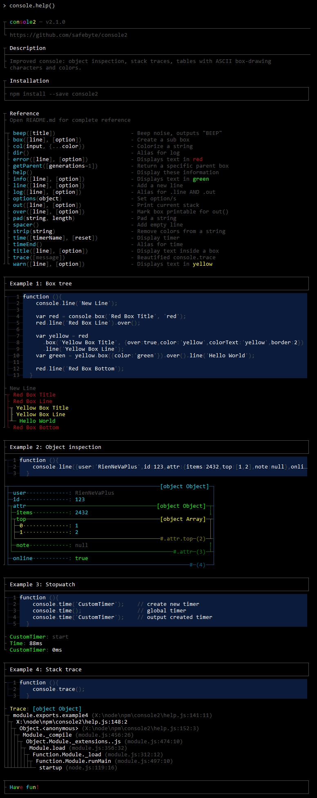

<h1 align="center">
	<br>
	<br>
	
	<br>
	<br>
	<br>
</h1>

#### Massively extends the `console` features to produce human readable output. Provides content boxes using ASCII box-drawing characters, improvements for the output of object inspections (using tables), stack traces and more. It can even beep! ####

## Features

- Structured output using [ASCII box-draing characters](https://en.wikipedia.org/wiki/Box-drawing_character)
- Fully compatible to the system `console`
- Improved object inspection (pretty nice tables)
- Improved stack traces
- Improved timer
- Ability to nest boxes
- Additional console features
- Various formatting shortcuts
- Clean and focused
- Intelligent use of colors to make contents even more distinguishable
- Actively maintained

## Install

```
$ npm install --save console2
```

### Quick Start

Have a [screenshot](/media/help.png) of the output because you're lazy.

```javascript
require('console2')();
console.help();
```

## Usage

Console2 integrates seamlessly into the node `console`. However, you should make yourself familiar with the additional features, especially `box`, `line` & `out`.

```javascript
require('console2')();

// log a string
console.log("They're minerals! Jesus Christ, Marie.");  // as you know and love it, native methods are fully supported

// start a timer
console.time('TimerTim');

// build a box
var box = console.box('I am a child.');

// add a line to our new box
box.line('I am the 2nd line of the sub box!');

// print the box - always required when using boxes
box.out();

// print timer
console.time('TimerTim');

// make noise
console.beep();
```

# Reference

Console2 not only improves the native console functions (`log`, `info`, `warn`, `error`, `dir`, `time`, `timeEnd`, `trace`) but also provides additional functions.

## console.help()
Displays a [short tutorial with examples](/media/help.png).

## console.box(content, option)
Create a sub box.

## console.line({...*}[, option])
Add a line.

## console.out()
Flush current buffer (use this to actually **see** something).

## console.title({String} line)
Creates a title by adding two lines (above & below) the text.

## console.beep({String} [label])
Makes your terminal beep, outputs `beep: label`.

## console.time({String} [label], {Boolean} [reset])
Very useful stopwatch that shows the elapsed time in a readable format (ms + years, months, days...).
**When called twice, the time in between the two calls is also meassured & displayed!**

```javascript
console.time()                              // Prints time since box was initialized
console.time('TimerTony') (1st call)        // starts a timer for tony, outputs 'TimerTony: start'
console.time('TimerTony', true) (1st call)  // same as above, no output
console.time('TimerTony') (2nd call)        // outputs 'TimerTony: Xms'
console.time('TimerTony', true) (2nd call)  // outputs 'TimerTony: Xms - reset', resets the timer
```

## console.trace({String} [label])
Beautified `console.trace`.

## console.options({Object|String|Number} data)

| Option         | Type          | Default   | Help                                            |
| -------------- |:------------- | ---------:|:----------------------------------------------- |
| color          | String        | grey      | Primary color                                   |
| colorText      | String        | grey      | Text color                                      |
| border         | Number        | 1         | Vertical border-width: `1` (`│`) or `2` (`║`)
| console        | Object        | `console` | Object to receive the output of console2.out.<br>Needs to have the same properties as the `console`. |
| disableNewline | Boolean       | false     | Disable the output of a `\n` character before every call of `console.out`.
| disableAutoOut | Boolean       | false     | Console2 tries to detect whether to automatically call<br>`console.out` after new lines have been added. You can disable this.
| override       | Boolean       | true      | Whether to override nodes `console`.<br>Can only be set when first calling the function returned by the module. |

**Shortcuts**

- `1`, `2` ⇔ sets `{border:Number}`
- chalk `color` or `command` (see console.col) ⇔ sets `{color:String,colorText::String}`

## console.col({String} input, {...String} color)
Colorizes the `input`, can take multiple colors / commands  ([see module `chalk`](https://github.com/chalk/chalk)).

- Colors: `cyan`, `green`, `yellow`, `red`, `magenta`, `blue`, `white`, `grey`, `black`
- Backgrounds: `bgCyan`, `bgGreen`, `bgYellow`, `bgRed`, `bgMagenta`, `bgBlue`, `bgWhite`, `bgGrey`, `bgBlack`
- Commands: `bold` (bright color), `dim` (dark color), `italic` (bad support), `underline` (bad support), `inverse`, `hidden`, `strikethrough` (bad support)
- Specials: `rainbow`, `zebra`, `code`

Use to colorize a string before adding it:

```javascript
console.log(console.col('I am a beautiful rainbow!', 'rainbow'));
```

## Aliases
Alias exist to cover features of the native `console` or to provide shortcuts for lazy people like me.

| Shortcut            |    | Alias                     |
| ------------------- | -- |-------------------------- |
| console **._**      | ⇔ | console **.line**         |
| console **.$**      | ⇔ | console **.out**          |
| console **.flush**  | ⇔ | console **.out**          |
| console **.info**   | ⇔ | console **.log** (green)  |
| console **.warn**   | ⇔ | console **.log** (yellow) |
| console **.error**  | ⇔ | console **.log** (red)    |
| console **.dir**    | ⇔ | console **.log**          |
| console **.timeEnd**| ⇔ | console **.log**          |

## Separate mode

console2 overrides the systems `console` object per default, so you don't have to rewrite your code.
You can disable this behaviour and use `console2` as a separate object by passing `false` into the main function.

```
var console2 = require('console2')(false); // "false" is a shortcut for the option {override:false}
console2.title('Hello World');
```

## Thanks to

- [async](https://github.com/caolan/async)
- [chalk](https://github.com/chalk/chalk)
- [linewrap](https://github.com/AnAppAMonth/linewrap)

<h1 align="center">
	console.help()
	<br>
	<br>
	
	<br>
	<br>
</h1>